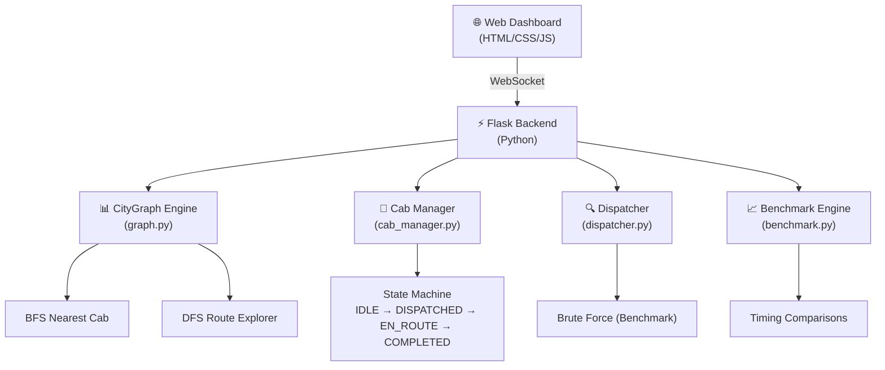

# 🚕 CabGrid: Real-Time Cab Dispatch Optimizer — Hackathon Roadmap

## Problem Summary

Build a smart cab dispatch system that models a city as a graph, uses **BFS** to find the nearest available cab (replacing brute-force), **DFS** to explore pickup routes, and manages cab lifecycle through **OS process states**. Benchmark BFS vs brute-force to prove algorithmic superiority.

---

## 🏗️ Architecture Overview



---

## 🎯 Deliverables Checklist

| # | Deliverable | Status |
|---|-------------|--------|
| 1 | Graph-based city model with **20+ nodes** | 🔲 |
| 2 | **BFS** nearest-cab search (shortest hops) | 🔲 |
| 3 | **DFS** route exploration from cab → passenger | 🔲 |
| 4 | Cab **process state machine** (IDLE → DISPATCHED → EN_ROUTE → COMPLETED) | 🔲 |
| 5 | Output log for every ride request + dispatch + state transition | 🔲 |
| 6 | **Brute-force vs BFS benchmark** with timing comparison | 🔲 |
| 7 | **Surge pricing** trigger at >60% cabs dispatched | 🔲 |
| 8 | Web dashboard with live visualization | 🔲 |

---

## 📁 Project Structure

```
FlashHackV2/
├── .gitignore
├── README.md
├── requirements.txt
├── docs/
│   └── architecture.md          # Architecture documentation
│
├── backend/
│   ├── __init__.py
│   ├── app.py                   # Flask app entry point + WebSocket
│   ├── graph.py                 # City graph model (adjacency list, BFS, DFS)
│   ├── cab_manager.py           # Cab process state machine
│   ├── dispatcher.py            # Dispatch logic (BFS, DFS, Brute-force)
│   ├── benchmark.py             # BFS vs Brute-force benchmarking
│   ├── surge_pricing.py         # Surge pricing engine
│   ├── city_data.py             # Hardcoded city graph (25 nodes, 40+ edges)
│   └── logger.py                # Structured event logger
│
├── frontend/
│   ├── index.html               # Main dashboard
│   ├── css/
│   │   └── style.css            # Premium dark-mode UI
│   └── js/
│       ├── app.js               # Main app logic
│       ├── graph_viz.js          # Canvas-based city graph visualization
│       ├── state_panel.js        # Cab state machine panel
│       └── websocket.js          # Real-time WebSocket client
│
└── tests/
    ├── test_graph.py             # Graph + BFS/DFS tests
    ├── test_cab_manager.py       # State machine tests
    └── test_dispatcher.py        # Dispatch logic tests
```

---

## 🔧 Tech Stack

| Layer | Technology | Why |
|-------|-----------|-----|
| Backend | **Python 3.10+** | Clean, fast prototyping, rich data structures |
| Web Framework | **Flask + Flask-SocketIO** | Lightweight, real-time WebSocket support |
| Frontend | **Vanilla HTML/CSS/JS** | No build step, fast iteration |
| Graph Viz | **HTML5 Canvas** | Smooth, animated graph rendering |
| Testing | **pytest** | Industry standard Python testing |

---

## 📐 Detailed Implementation Plan

### Phase 1: Core Data Structures & Graph Engine `[~2 hours]`

#### [NEW] `backend/city_data.py`
- Define a city graph with **25 intersections** (nodes) and **40+ roads** (edges)
- Use adjacency list representation: `dict[int, list[int]]`
- Node metadata: name, coordinates (for visualization)
- Edge metadata: distance/weight (optional, for weighted BFS extension)

#### [NEW] `backend/graph.py`
- `CityGraph` class wrapping the adjacency list
- **`bfs_nearest_cab(start, available_cabs)`** — BFS from passenger node, returns first cab found (shortest hops)
- **`dfs_explore_routes(start, end, max_depth)`** — DFS from cab to passenger, returns all possible routes up to max_depth
- **`brute_force_nearest_cab(start, available_cabs)`** — iterate ALL cabs, compute BFS distance to each, return minimum
- Helper: `shortest_path(start, end)` — BFS-based path finder

> [!IMPORTANT]
> **BFS vs Brute Force Distinction:**
> - **BFS** expands outward from passenger node, stops at the FIRST cab found → O(V + E) worst case but typically much faster
> - **Brute Force** computes distance to EVERY cab then picks minimum → O(C × (V + E)) where C = number of cabs
> This difference is critical for the judges — it must be clearly demonstrated.

---

### Phase 2: Cab Process State Machine `[~1.5 hours]`

#### [NEW] `backend/cab_manager.py`
- `CabState` enum: `IDLE`, `DISPATCHED`, `EN_ROUTE`, `COMPLETED`
- Map to OS process states:
  | Cab State | OS Process State | Description |
  |-----------|-----------------|-------------|
  | IDLE | **Ready** | Cab available, waiting for assignment |
  | DISPATCHED | **Running** | Cab assigned to a ride, computing route |
  | EN_ROUTE | **Waiting** | Cab traveling to pickup/destination |
  | COMPLETED | **Terminated** | Ride finished, cab returns to IDLE |

- `Cab` class with:
  - `id`, `name`, `current_node`, `state`, `state_history[]`
  - `transition(new_state)` — validates legal transitions, logs event
  - State transition diagram enforced:
    ```
    IDLE → DISPATCHED → EN_ROUTE → COMPLETED → IDLE
                                              ↗
    Any State → IDLE (cancellation/reset)
    ```
- `CabManager` class:
  - Manages fleet of cabs
  - `get_available_cabs()` → returns cabs in IDLE state
  - `get_fleet_status()` → snapshot of all cab states
  - `get_dispatched_ratio()` → for surge pricing

---

### Phase 3: Dispatcher & Surge Pricing `[~1.5 hours]`

#### [NEW] `backend/dispatcher.py`
- `Dispatcher` class:
  - `dispatch_ride(passenger_node)`:
    1. Get available cabs from CabManager
    2. Run BFS nearest-cab search
    3. Run DFS to explore alternative routes
    4. Transition cab: IDLE → DISPATCHED → EN_ROUTE
    5. Log everything
    6. Return dispatch result with route info
  - `dispatch_ride_brute_force(passenger_node)` — same but uses brute force

#### [NEW] `backend/surge_pricing.py`
- `SurgePricingEngine`:
  - Base fare multiplier: `1.0x`
  - When dispatched ratio > 60%: `1.5x` surge
  - When dispatched ratio > 80%: `2.0x` surge
  - Emits surge events for the dashboard

#### [NEW] `backend/logger.py`
- Structured event logger
- Events: `RIDE_REQUEST`, `CAB_DISPATCHED`, `STATE_CHANGE`, `ROUTE_FOUND`, `BENCHMARK_RESULT`, `SURGE_TRIGGERED`
- Each log entry: `timestamp | event_type | details`
- Maintains in-memory log for dashboard streaming

---

### Phase 4: Benchmarking Engine `[~1 hour]`

#### [NEW] `backend/benchmark.py`
- `BenchmarkEngine`:
  - Scale test graph to **100, 200, 500 nodes** (procedurally generated)
  - Run same dispatch requests against BFS and Brute Force
  - Measure execution time with `time.perf_counter()`
  - Generate comparison report:
    ```
    | Nodes | Cabs | BFS Time (ms) | Brute Force Time (ms) | Speedup |
    |-------|------|---------------|----------------------|---------|
    | 25    | 10   | 0.12          | 0.45                 | 3.75x   |
    | 100   | 50   | 0.34          | 8.72                 | 25.6x   |
    | 500   | 200  | 1.23          | 198.45               | 161.3x  |
    ```

---

### Phase 5: Flask Backend + WebSocket `[~2 hours]`

#### [NEW] `backend/app.py`
- Flask app with SocketIO
- REST endpoints:
  - `GET /api/graph` — returns city graph data
  - `GET /api/cabs` — returns all cab statuses
  - `GET /api/logs` — returns event log
  - `POST /api/dispatch` — trigger ride dispatch
  - `POST /api/benchmark` — run benchmark suite
- WebSocket events:
  - `cab_state_change` — real-time cab state updates
  - `dispatch_event` — ride dispatch notifications
  - `surge_update` — surge pricing changes
  - `log_event` — live log streaming

---

### Phase 6: Premium Web Dashboard `[~3 hours]`

#### [NEW] `frontend/index.html`
Four-panel dark-mode dashboard:
1. **City Graph Visualization** — interactive Canvas rendering of the city graph with animated cab positions, BFS wave animation, DFS path highlighting
2. **Cab Fleet Status** — real-time grid showing all cabs with their current state (color-coded), node location, and state history
3. **Dispatch Control Panel** — select pickup node, trigger dispatch, see BFS vs brute-force results side-by-side
4. **Live Event Log** — scrolling log of all events with color-coded entries

#### [NEW] `frontend/css/style.css`
- Dark mode with glassmorphism cards
- Neon accent colors for cab states:
  - IDLE: `#00ff88` (green glow)
  - DISPATCHED: `#ff6b35` (orange pulse)
  - EN_ROUTE: `#4ecdc4` (cyan trail)
  - COMPLETED: `#95a5a6` (gray fade)
- Smooth animations for state transitions
- Responsive grid layout

#### [NEW] `frontend/js/graph_viz.js`
- Canvas-based force-directed graph layout
- Animated BFS wave expansion (ripple effect)
- DFS path tracing animation
- Cab icons on nodes with state-colored indicators

#### [NEW] `frontend/js/state_panel.js`
- Real-time cab state cards
- State machine diagram with active state highlighted
- State transition history timeline

#### [NEW] `frontend/js/app.js`
- Main application controller
- Dispatch request handling
- Benchmark result display with charts

#### [NEW] `frontend/js/websocket.js`
- WebSocket connection management
- Real-time event handling and UI updates

---

## ⏱️ Execution Timeline (Hackathon Sprint)

```mermaid
gantt
    title CabGrid Hackathon Sprint
    dateFormat HH:mm
    axisFormat %H:%M

    section Core Engine
    City Graph + BFS/DFS          :a1, 00:00, 2h
    Cab State Machine             :a2, after a1, 1.5h

    section Logic Layer
    Dispatcher + Surge Pricing    :b1, after a2, 1.5h
    Benchmark Engine              :b2, after b1, 1h

    section Backend
    Flask + WebSocket API         :c1, after b2, 2h

    section Frontend
    Dashboard UI                  :d1, after c1, 3h

    section Polish
    Testing + Documentation       :e1, after d1, 1h
```



**Total estimated time: ~12 hours**

---

## ✅ Verification Plan

### Automated Tests
```bash
# Run all tests
pytest tests/ -v

# Run specific test suites
pytest tests/test_graph.py -v        # BFS/DFS correctness
pytest tests/test_cab_manager.py -v  # State machine transitions
pytest tests/test_dispatcher.py -v   # Dispatch logic
```

### Manual Verification
1. **Graph correctness**: Verify BFS finds shortest-hop cab on known graph
2. **State machine**: Verify illegal transitions are rejected (e.g., IDLE → EN_ROUTE)
3. **Benchmark**: Confirm BFS outperforms brute-force on 500-node graph
4. **Surge pricing**: Dispatch >60% of cabs and verify surge triggers
5. **Dashboard**: Visual verification of graph animation, cab states, and live logs

### Demo Script for Judges
1. Show the city graph with all cabs in IDLE state
2. Trigger 3 ride requests — show BFS finding nearest cab with wave animation
3. Show state transitions in real-time on the fleet panel
4. Trigger enough rides to activate surge pricing
5. Run benchmark comparison — show the performance table
6. Show DFS route exploration for a specific cab-passenger pair

---

## 🏆 Hackathon Winning Strategy

> [!TIP]
> **What judges look for:**
> 1. **Visual wow factor** — The animated graph with BFS wave ripples and cab state transitions will stand out
> 2. **Clear algorithm understanding** — The BFS vs brute-force benchmark with real numbers proves you understand WHY BFS is better
> 3. **OS concepts integration** — State machine with transition logging shows process management knowledge
> 4. **Completeness** — All deliverables + both bonus challenges implemented
> 5. **Live demo** — Real-time dashboard running in browser beats static terminal output every time

---

## Open Questions

> [!IMPORTANT]
> 1. **Language preference**: The plan uses **Python** (Flask backend + vanilla JS frontend). The problem statement allows Python/Java/C++. Should we stick with Python?
> 2. **Graph type**: Should edges be **weighted** (distance-based) or **unweighted** (hop-based)? The problem says "shortest hops" suggesting unweighted, but weighted adds realism.
> 3. **Visualization scope**: The plan includes a full web dashboard with canvas animations. If time is tight, we can fall back to a terminal-based output. Preference?
> 4. **Team size**: Are you working solo or with a team? This affects how we parallelize the work.
