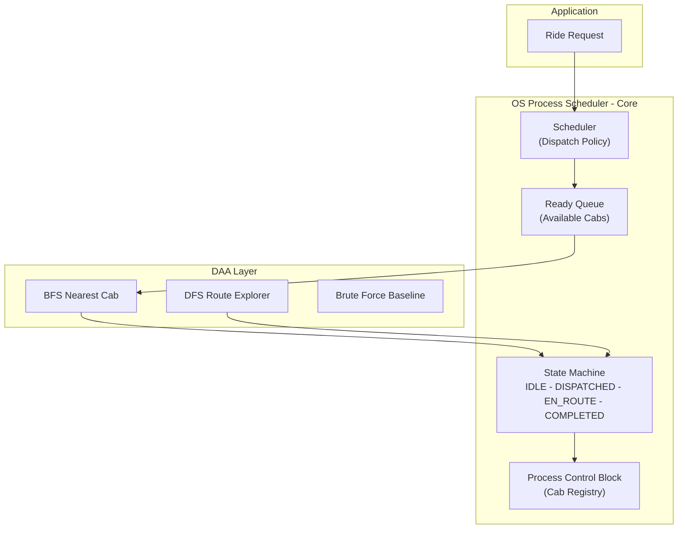

# 🚕 CabGrid — Implementation Plan (3-Hour Sprint, 2 Members)

## Goal

Build a real-time cab dispatch optimizer where the **OS process state model is the core engine** — not a side feature. The city is a graph, BFS finds the nearest cab, DFS explores routes, and every dispatch decision flows through a process state machine that controls cab availability, scheduling, and lifecycle.

---

## 🏗️ Architecture — OS-First Design



**Key Design Decision**: The dispatcher **cannot operate without** the state machine. A cab can only be dispatched if its process state is `READY (IDLE)`. The scheduler pulls from a ready queue. State transitions trigger real system events. This mirrors how an OS scheduler manages processes.

---

## 📐 OS ↔ Cab Deep Integration

| OS Concept | Implementation in CabGrid | Why It Matters |
|-----------|---------------------------|---------------|
| **Process Control Block (PCB)** | Each `Cab` holds: `pid`, `state`, `priority`, `current_node`, `assigned_ride`, `state_history[]`, `created_at` | PCB is the single source of truth — dispatcher reads it, scheduler updates it |
| **Process States** | `NEW → READY → RUNNING → WAITING → TERMINATED` mapped to `REGISTERED → IDLE → DISPATCHED → EN_ROUTE → COMPLETED` | State determines what operations are legal — can't dispatch a cab that's EN_ROUTE |
| **Ready Queue** | `CabScheduler.ready_queue` — only IDLE cabs live here | BFS searches ONLY within the ready queue, not all cabs |
| **State Transition Validation** | Illegal transitions raise `InvalidStateTransition` error | Prevents double-dispatching a cab |
| **Process Scheduling** | FCFS for ride requests; Nearest-first (BFS) for cab selection | Two scheduling policies working together |
| **Context Switch** | When cab goes IDLE→DISPATCHED, ride context (route, passenger, pickup) is loaded | Mirrors how OS saves/restores process context |
| **Process Table** | `CabScheduler.process_table()` — snapshot of ALL cab PCBs | Displayed after every dispatch event (like `ps` command) |
| **Deadlock Prevention** | A cab cannot be assigned to two rides simultaneously (mutual exclusion) | Real OS concept applied to dispatch |

---

## 📁 Project Structure

```
FlashHackV2/
├── backend/
│   ├── __init__.py
│   ├── app.py                   # Flask + WebSocket entry point
│   ├── city_graph.py            # City graph model, BFS, DFS, brute-force
│   ├── cab_process.py           # PCB + State machine + transition validation
│   ├── scheduler.py             # Ready queue + dispatch scheduler (OS core)
│   ├── dispatcher.py            # Ride dispatch orchestrator
│   ├── benchmark.py             # BFS vs brute-force benchmarking
│   ├── surge_pricing.py         # Surge pricing engine
│   └── event_logger.py          # Structured dispatch event logger
├── frontend/
│   ├── index.html
│   ├── css/style.css
│   └── js/
│       ├── app.js
│       ├── graph_viz.js
│       ├── state_panel.js
│       └── websocket.js
├── tests/
│   ├── __init__.py
│   ├── test_graph.py
│   ├── test_cab_process.py
│   └── test_scheduler.py
├── docs/architecture.md
├── requirements.txt
├── .gitignore
└── README.md
```

---

## ⏱️ 3-HOUR SPRINT — MEMBER A (Backend / Algo)

### Hour 1 (0:00 – 1:00) — Core Engine

| Time | Task | File | Deliverable |
|------|------|------|-------------|
| 0:00–0:20 | Build 25-node city graph with adjacency list + node coordinates | `city_graph.py` | Graph class with nodes, edges, metadata |
| 0:20–0:40 | Implement BFS nearest-cab (searches ready queue only) + DFS route explorer | `city_graph.py` | `bfs_nearest_cab()`, `dfs_explore_routes()`, `brute_force_nearest()` |
| 0:40–1:00 | Build cab PCB + state machine with transition validation | `cab_process.py` | `CabPCB` class, `CabState` enum, `InvalidStateTransition`, state history logging |

**Hour 1 Checkpoint**: Can run in terminal — BFS finds nearest cab, state transitions print correctly, illegal transitions raise errors.

### Hour 2 (1:00 – 2:00) — Scheduler + Features

| Time | Task | File | Deliverable |
|------|------|------|-------------|
| 1:00–1:25 | Build OS-style scheduler with ready queue, FCFS ride queue, dispatch flow | `scheduler.py` | `CabScheduler` class: `dispatch_bfs()`, `complete_ride()`, `process_table()` |
| 1:25–1:40 | Build dispatcher wrapper + event logger | `dispatcher.py`, `event_logger.py` | Full dispatch orchestrator, structured event log |
| 1:40–1:50 | Build surge pricing engine | `surge_pricing.py` | Surge triggers at >60% dispatched |
| 1:50–2:00 | Build benchmark engine (BFS vs brute-force on 25/100/500 nodes) | `benchmark.py` | Timing comparison table with real numbers |

**Hour 2 Checkpoint**: Full dispatch flow works end-to-end. Benchmark shows BFS speedup. Surge pricing triggers.

### Hour 3 (2:00 – 3:00) — API + Tests + Docs

| Time | Task | File | Deliverable |
|------|------|------|-------------|
| 2:00–2:25 | Build Flask API endpoints + WebSocket events | `app.py` | All REST endpoints + SocketIO events working |
| 2:25–2:45 | Write tests for graph, state machine, scheduler | `tests/` | pytest passing for BFS/DFS, state transitions, ready queue |
| 2:45–3:00 | Polish README with design decisions, add docstrings to all files | `README.md` | Clean docs explaining OS integration and algorithm choices |

---

## ⏱️ 3-HOUR SPRINT — MEMBER B (Frontend / UI)

### Hour 1 (0:00 – 1:00) — Dashboard Skeleton

| Time | Task | File | Deliverable |
|------|------|------|-------------|
| 0:00–0:30 | Build 4-panel dark-mode dashboard layout | `index.html`, `style.css` | Glassmorphism cards, responsive grid, state color tokens |
| 0:30–0:45 | Build cab state panel (process table display) | `state_panel.js` | Table: PID, Name, State (color badge), Node, Ride |
| 0:45–1:00 | Build dispatch control panel with buttons + result display | `app.js` | Select pickup node → click dispatch → show result area |

**Hour 1 Checkpoint**: Dashboard loads in browser with styled layout, mock data in process table, dispatch controls visible.

### Hour 2 (1:00 – 2:00) — Graph Viz + Wiring

| Time | Task | File | Deliverable |
|------|------|------|-------------|
| 1:00–1:30 | Build Canvas city graph rendering with cab dots (color = state) | `graph_viz.js` | City graph visible, cabs shown at their nodes |
| 1:30–1:45 | Wire WebSocket client for real-time updates | `websocket.js` | State changes, dispatch events, log entries streaming |
| 1:45–2:00 | Wire dispatch buttons to API, display BFS vs brute-force results | `app.js` | Click dispatch → API call → result shown with timing |

**Hour 2 Checkpoint**: Full integration — dispatch on dashboard triggers backend, graph updates, states change in real-time.

### Hour 3 (2:00 – 3:00) — Animations + Polish

| Time | Task | File | Deliverable |
|------|------|------|-------------|
| 2:00–2:20 | Add BFS wave ripple animation on dispatch | `graph_viz.js` | Concentric circles expand from passenger node |
| 2:20–2:35 | Add state badge pulse animation, surge pricing banner | `style.css`, `state_panel.js` | Visual state transitions, red glow on surge |
| 2:35–2:50 | Add live event log panel with auto-scroll | `app.js` | Scrolling color-coded log entries |
| 2:50–3:00 | Final demo test — run full demo flow together | — | End-to-end working demo |

---

## 🔗 Integration Contract (Agree at Minute 0)

Both members agree on this API before starting so they can work independently:

```python
# Member A exposes these in app.py:

GET  /api/graph     → {nodes: [{id, name, x, y}], edges: [[from, to]]}
GET  /api/cabs      → {cabs: [{pid, name, state, node, ride, history}]}
GET  /api/logs      → {logs: [{timestamp, event, details}]}
GET  /api/surge     → {active: bool, multiplier: float}
POST /api/dispatch  → {passenger_node: int, method: "bfs"|"brute"}
                    → {cab, route, hops, time_ms, alternatives, process_table, surge}
POST /api/benchmark → {results: [{nodes, cabs, bfs_ms, brute_ms, speedup}]}
POST /api/complete  → {cab_pid: int} → completes ride, returns cab to IDLE

# WebSocket events (server → client):
emit('state_change',    {pid, old_state, new_state, reason, timestamp})
emit('dispatch_event',  {cab, passenger_node, route, method})
emit('surge_update',    {active, multiplier})
emit('log_entry',       {timestamp, event, details})
```

Member B can use mock data for Hour 1 and wire real API in Hour 2.

---

## 🔑 Design Decisions (For README Comments)

1. **"Why does BFS only search the ready queue?"** — Like an OS scheduler only considers READY processes, our dispatcher only considers IDLE cabs. Makes BFS faster AND semantically correct.

2. **"Why a PCB per cab?"** — Each cab carries state, context (ride, route), and history. Mirrors PCBs in operating systems. Makes the system debuggable — inspect any cab's full lifecycle.

3. **"Why validate state transitions?"** — Prevents double-dispatching (like an OS can't schedule an already-running process). Real mutual exclusion on cab resources.

4. **"Why separate ready queue?"** — O(1) queue management vs O(n) scanning all cabs. Same reason OS maintains a ready queue instead of scanning the full process table.

---

## ✅ Edge Cases to Handle

- Dispatch when **no cabs are IDLE** (ready queue empty) → return error message
- Passenger at **isolated node** (no edges) → return unreachable error
- Cab at **same node** as passenger (0 hops) → instant dispatch
- **Rapid consecutive dispatches** (queue draining fast)
- **All cabs dispatched** → surge triggers at 1.5x, then 2.0x
- **Complete all rides** → all cabs return to IDLE, ready queue refills
- **Invalid state transition** (IDLE → EN_ROUTE directly) → raise error with message
- **Duplicate dispatch** attempt on same cab → mutual exclusion blocks it

---

## ✅ Verification

```bash
pytest tests/ -v                # All tests
python -m backend.benchmark     # BFS vs brute-force numbers
python -m backend.app           # Start server → http://localhost:5000
```

### Demo Flow (5 minutes)
1. Show city graph with all cabs IDLE (green dots)
2. Dispatch 3 rides — see BFS wave, cab turns orange, process table updates
3. Show state transition log (NEW→IDLE→DISPATCHED→EN_ROUTE)
4. Dispatch enough to trigger surge pricing (>60%)
5. Complete rides — cabs return to IDLE
6. Run benchmark — show BFS vs brute-force timing table
7. Show DFS alternative routes for a specific dispatch
8. Try invalid transition — show error handling
